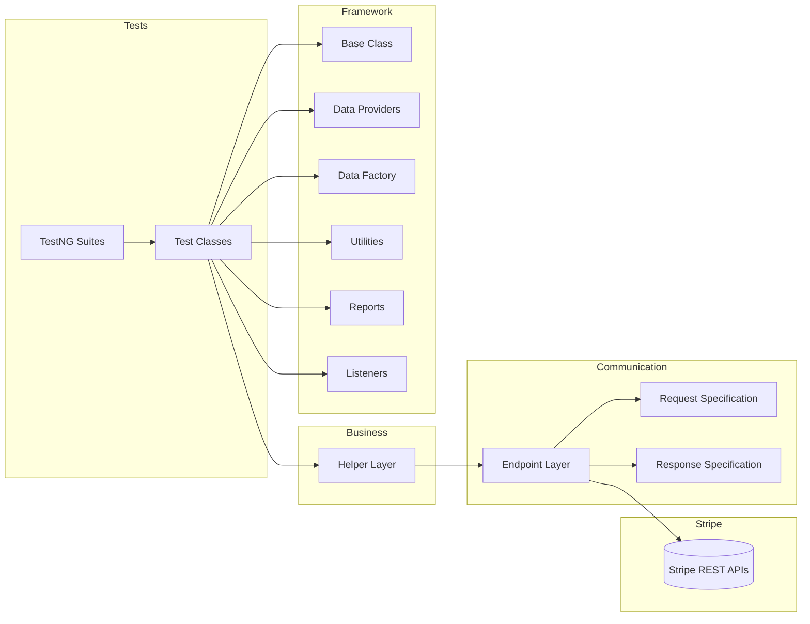

<div align="center">

# Hi there 👋 I'm Soumalya Hajra

### QA Automation Engineer | Java | Selenium | Rest Assured | TestNG | CI/CD Enthusiast


<p>

</p>

</div>

---

# 🚀 About Me

I'm a **QA Automation Engineer** passionate about designing scalable automation frameworks that improve software quality and accelerate delivery.

- 💼 Software Tester with 1+ years of industry experience
- 🔥 Specialized in API Automation using Rest Assured
- 🌐 Experienced in Selenium WebDriver Automation
- ⚙️ Building enterprise-grade automation frameworks
- 📊 Passionate about clean architecture and reusable code
- 🚀 Currently learning CI/CD, Docker and DevOps
- 💡 Always exploring better testing strategies

---

# 🛠 Tech Stack

### Languages

<p>

</p>

### Automation

<p>


</p>

### DevOps

<p>

</p>

### IDE

<p>

</p>

### Database

<p>

</p>

---

# 📚 Currently Learning

```text
✔ Advanced Selenium Framework Design

✔ Enterprise API Automation

✔ Jenkins Pipelines

✔ Docker

✔ CI/CD

✔ Kubernetes

✔ AWS

✔ Playwright
```

---

# ⭐ Featured Projects

## Stripe API Automation Framework

Enterprise-level API automation framework built using

- Java
- Rest Assured
- TestNG
- Maven
- Log4j2
- Extent Reports
- Request Specification
- Response Specification
- ThreadLocal Test Context
- Data Factory
- Data Providers
- Listeners
- Parallel Execution
- Retry Mechanism
- Utility Classes

### Framework Architecture



---

## Selenium Automation Framework

Features

- Page Object Model
- Explicit Waits
- Utilities
- Retry Analyzer
- Screenshot Capture
- Logging
- Extent Reports
- Cross-browser Ready
- Maven Project
- TestNG Integration

---

## CI/CD Journey

Currently building

- Jenkins Pipelines
- Dockerized Test Execution
- GitHub Actions
- Parallel Execution
- Automated Reporting

---

# 📊 GitHub Analytics

<div align="center">


</div>

---

<div align="center">


</div>

---

<div align="center">


</div>

---

# 🏆 Achievements

- Built Enterprise Stripe API Automation Framework
- Created Scalable Selenium Automation Framework
- Experienced in Manual & Automation Testing
- Strong Java Programming Fundamentals
- Learning DevOps & CI/CD
- Passionate about Software Quality Engineering

---

# 🎯 2026 Goals

- [x] Enterprise API Automation
- [x] Selenium Framework
- [x] Java
- [x] TestNG
- [ ] Jenkins Mastery
- [ ] Docker
- [ ] Kubernetes
- [ ] AWS
- [ ] Playwright
- [ ] Performance Testing

---

# 📈 What I Love Building

```text
Enterprise Automation Frameworks

API Testing

Reusable Utilities

Reporting Systems

CI/CD Pipelines

Testing Architecture

Clean Code

Automation Best Practices
```

---

# ⚡ Fun Facts

🏋 Gym Enthusiast

🎮 Valorant Player

⚽ Cristiano Ronaldo Fan

🏏 Virat Kohli Fan

☕ Coffee + Automation = ❤️

---

# 🤝 Connect With Me

LinkedIn: YOUR_LINKEDIN

Email: YOUR_EMAIL

Portfolio: Coming Soon

---

<div align="center">

### ⭐ If you like my work, consider giving a star to my repositories!

*"Quality is never an accident; it is always the result of intelligent effort."*

</div>## Hi there 👋

<!--
**SoumalyA007/SoumalyA007** is a ✨ _special_ ✨ repository because its `README.md` (this file) appears on your GitHub profile.

Here are some ideas to get you started:

- 🔭 I’m currently working on ...
- 🌱 I’m currently learning ...
- 👯 I’m looking to collaborate on ...
- 🤔 I’m looking for help with ...
- 💬 Ask me about ...
- 📫 How to reach me: ...
- 😄 Pronouns: ...
- ⚡ Fun fact: ...
-->
